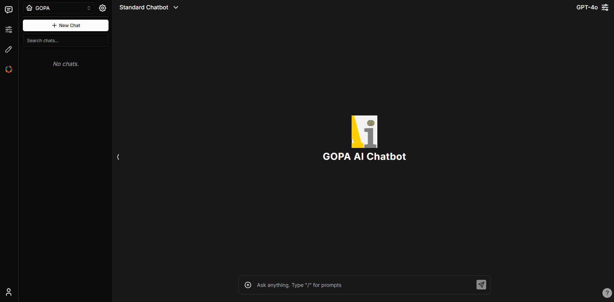

# Chatbot UI

The open-source AI chat app for everyone.



## Deployment
### To start the chatbot-ui:

```bash
  cd chatbotui-v2
  docker-compose up -d
```

### To stop the chatbot-ui:

```bash
  cd chatbotui-v2
  docker-compose down
```

### To rebuild the chatbot-ui:

```bash
  cd chatbotui-v2
  docker-compose down
  docker system prune --all
  docker-compose up -d --build
```

### How to change `env` file of the chatbot-ui:

```bash
  cd chatbotui-v2
  nano .env.local
```

### How to ENABLE `Magic Link` for login in chatbot-ui:

```bash
  cd chatbotui-v2
  nano .env.local
  # here you should find property NEXT_PUBLIC_MAGIC_LINK_ENABLED and set to true -- like this: NEXT_PUBLIC_MAGIC_LINK_ENABLED=true
  docker-compose down
  docker system prune --all
  ≈
```

### How to DISABLE `Magic Link` for login in chatbot-ui:

```bash
  cd chatbotui-v2
  nano .env.local
  # here you should find property NEXT_PUBLIC_MAGIC_LINK_ENABLED and set to false -- like this: NEXT_PUBLIC_MAGIC_LINK_ENABLED=false
  docker-compose down
  docker system prune --all
  docker-compose up -d --build
```

## Local Quickstart

Follow these steps to get your own Chatbot UI instance running locally.

### 1. Clone the Repo

```bash
git clone https://github.com/shortyfactory/chatbotui-v2.git
```

### 2. Install Dependencies

Open a terminal in the root directory of your local Chatbot UI repository and run:

```bash
npm install
```

### 3. Install Supabase & Run Locally

#### Why Supabase?

Previously, we used local browser storage to store data. However, this was not a good solution for a few reasons:

- Security issues
- Limited storage
- Limits multi-modal use cases

#### 1. Install Docker

You will need to install Docker to run Supabase locally. You can download it [here](https://docs.docker.com/get-docker) for free.

#### 2. Install Supabase CLI

**MacOS/Linux**

```bash
brew install supabase/tap/supabase
```

**Windows**

```bash
scoop bucket add supabase https://github.com/supabase/scoop-bucket.git
scoop install supabase
```

#### 3. Start Supabase

In your terminal at the root of your local Chatbot UI repository, run:

```bash
supabase start
```

### 4. Fill in Secrets

#### 1. Environment Variables

In your terminal at the root of your local Chatbot UI repository, run:

```bash
cp .env.local.example .env.local
```

Get the required values by running:

```bash
supabase status
```

Note: Use `API URL` from `supabase status` for `NEXT_PUBLIC_SUPABASE_URL`
Note: Use `anon key` from `supabase status` for `NEXT_PUBLIC_SUPABASE_ANON_KEY`
Note: Use `service_role key` from `supabase status` for `SUPABASE_SERVICE_ROLE_KEY`

Now go to your `.env.local` file and fill in the values.

If the environment variable is set, it will disable the input in the user settings.

#### 2. SQL Setup

In the 1st migration file `supabase/migrations/20240108234540_setup.sql` you will need to replace 2 values with the values you got above:

- `project_url` (line 53): `http://supabase_kong_chatbotui:8000` (default) can remain unchanged if you don't change your `project_id` in the `config.toml` file
- `service_role_key` (line 54): You got this value from running `supabase status`

This prevents issues with storage files not being deleted properly.

### 6. Run app locally

In your terminal at the root of your local Chatbot UI repository, run:

```bash
npm run chat
```

Your local instance of Chatbot UI should now be running at [http://localhost:3000](http://localhost:3000). Be sure to use a compatible node version (i.e. v18).

You can view your backend GUI at [http://localhost:54323/project/default/editor](http://localhost:54323/project/default/editor).

## Hosted Supabase Quickstart

Follow these steps to get your own Chatbot UI instance running in the cloud.

### 1. Follow Local Quickstart

Repeat steps 1-3 in "Local Quickstart" above.

### 2. Setup Backend with Supabase

#### 1. Create a new project

Go to [Supabase](https://supabase.com/) and create a new project.

#### 2. Get Project Values

Once you are in the project dashboard, click on the "Project Settings" icon tab on the far bottom left.

Here you will get the values for the following environment variables:

- `Project Ref`: Found in "General settings" as "Reference ID"

- `Project ID`: Found in the URL of your project dashboard (Ex: https://supabase.com/dashboard/project/<YOUR_PROJECT_ID>/settings/general)

While still in "Settings" click on the "API" text tab on the left.

Here you will get the values for the following environment variables:

- `Project URL`: Found in "API Settings" as "Project URL"

- `Anon key`: Found in "Project API keys" as "anon public"

- `Service role key`: Found in "Project API keys" as "service_role" (Reminder: Treat this like a password!)

#### 3. Configure Auth

Next, click on the "Authentication" icon tab on the far left.

In the text tabs, click on "Providers" and make sure "Email" is enabled.

#### 4. Environment Variables

In your terminal at the root of your Chatbot UI repository, run:

```bash
cp .env.local.example .env.local
```

Now go to your `.env.local` file and fill in the values.

If the environment variable is set, it will disable the input in the user settings.


#### 5. Connect to Hosted DB

Open up your repository for your hosted instance of Chatbot UI.

In the 1st migration file `supabase/migrations/20240108234540_setup.sql` you will need to replace 2 values with the values you got above:

- `project_url` (line 53): Use the `Project URL` value from above
- `service_role_key` (line 54): Use the `Service role key` value from above

Now, open a terminal in the root directory of your Chatbot UI repository. We will execute a few commands here.

Login to Supabase by running:

```bash
supabase login
```

Next, link your project by running the following command with the "Project ID" you got above:

```bash
supabase link --project-ref <project-id>
```

Your project should now be linked.

Finally, push your database to Supabase by running:

```bash
supabase db push
```

Your hosted database should now be set up!

#### 6. Run App in Docker

In your terminal at the root of your local Chatbot UI repository, run:

```bash
docker-compose up -d --build
```

Your instance of Chatbot UI should now be running at [http://localhost:3000](http://localhost:3000).

## How to move from Hosted Supabase to Local Supabase
#### 1. Get the required values
In your terminal at the root of your Chatbot UI repository, run:

```bash
supabase start
```

Get the required values by running:

```bash
supabase status
```

#### 2. SQL Setup

In the 1st migration file `supabase/migrations/20240108234540_setup.sql` you will need to replace 2 values with the values you got above:

- `project_url` (line 53): `http://supabase_kong_chatbotui:8000` (default) can remain unchanged if you don't change your `project_id` in the `config.toml` file
- `service_role_key` (line 54): You got this value from running `supabase status` - (`service_role key`)

This prevents issues with storage files not being deleted properly.

#### 3. Environment Variables
Now go to your `.env.local` file and change the values with values that you got from running `supabase status`.

Note: 
- Use `API URL` from `supabase status` for `NEXT_PUBLIC_SUPABASE_URL`
- Use `anon key` from `supabase status` for `NEXT_PUBLIC_SUPABASE_ANON_KEY`
- Use `service_role key` from `supabase status` for `SUPABASE_SERVICE_ROLE_KEY`
If the environment variable is set, it will disable the input in the user settings.

### 4. Run app locally

In your terminal at the root of your Chatbot UI repository, run:

```bash
npm run chat
```

Your instance of Chatbot UI should now be running at [http://localhost:3000](http://localhost:3000).

## How to move from Local Supabase to Hosted Supabase
#### 1. Create a new Supabase project

Go to [Supabase](https://supabase.com/) and create a new project.

#### 2. Get Project Values

Once you are in the project dashboard, click on the "Project Settings" icon tab on the far bottom left.

Here you will get the values for the following environment variables:

- `Project Ref`: Found in "General settings" as "Reference ID"

- `Project ID`: Found in the URL of your project dashboard (Ex: https://supabase.com/dashboard/project/<YOUR_PROJECT_ID>/settings/general)

While still in "Settings" click on the "API" text tab on the left.

Here you will get the values for the following environment variables:

- `Project URL`: Found in "API Settings" as "Project URL"

- `Anon key`: Found in "Project API keys" as "anon public"

- `Service role key`: Found in "Project API keys" as "service_role" (Reminder: Treat this like a password!)

#### 3. Configure Auth

Next, click on the "Authentication" icon tab on the far left.

In the text tabs, click on "Providers" and make sure "Email" is enabled.

#### 4. Environment Variables

In your terminal at the root of your Chatbot UI repository, run:

```bash
cp .env.local.example .env.local
```

Now go to your `.env.local` file and change the values.

If the environment variable is set, it will disable the input in the user settings.


#### 5. Connect to Hosted DB

Open up your repository for your hosted instance of Chatbot UI.

In the 1st migration file `supabase/migrations/20240108234540_setup.sql` you will need to replace 2 values with the values you got above:

- `project_url` (line 53): Use the `Project URL` value from above
- `service_role_key` (line 54): Use the `Service role key` value from above

Now, open a terminal in the root directory of your Chatbot UI repository. We will execute a few commands here.

Login to Supabase by running:

```bash
supabase login
```

Next, link your project by running the following command with the "Project ID" you got above:

```bash
supabase link --project-ref <project-id>
```

Your project should now be linked.

Finally, push your database to Supabase by running:

```bash
supabase db push
```

Your hosted database should now be set up!

#### 6. Run App in Docker

In your terminal at the root of your local Chatbot UI repository, run:

```bash
docker-compose up -d --build
```

Your instance of Chatbot UI should now be running at [http://localhost:3000](http://localhost:3000).

## How to change App Logo
### 1. Prepare new logo

- Image should be only in `PNG` format
- Name should be `chatbot-ui-logo` so the name with the extension will be `chatbot-ui-logo.png`

### 2. Replace the old logo with the new one

- Go to folder `public`
- Remove file `chatbot-ui-logo.png`
- Paste your new logo here

### 3. Rebuild App if you use docker

Open a terminal in the root directory of your Chatbot UI repository and run a few commands:

```bash
  docker-compose down
  docker system prune --all
  docker-compose up -d --build
```

## How to rebuild App with new changes from GitHub
### 1. Pull changes
First check if you don't have any local changes for git

Open a terminal in the root directory of your Chatbot UI repository and run:

```bash
git status
```

If all is OK then pull changes from GitHub with command:

```bash
git pull
```

### 2. Rebuild App with Docker
In the root directory of your Chatbot UI repository and run:

```bash
  docker-compose down
  docker system prune --all
  docker-compose up -d --build
```


## How to run App in the new Linux VM from GitHub
### 1. Open Ports

You need to open several ports:
  - `3000` - application port
  - `54321` - need for application access to supabase
  - `54323` - here will be your local supabase GUI (*optional)

### 2. Install Homebrew

[How to install Homebrew](https://www.digitalocean.com/community/tutorials/how-to-install-and-use-homebrew-on-linux)

### 3. Install Nodejs

[How to Install Node using NVM](https://www.digitalocean.com/community/tutorials/how-to-install-node-js-on-ubuntu-20-04#option-3-installing-node-using-the-node-version-manager)

Then you need to install Node `v18.20.2` via NVM:

```bash
  nvm install 18.20.2
  nvm use 18.20.2
```


### 4. Install Docker Engine

[How to install Docker Engine](https://docs.docker.com/engine/install/ubuntu/#install-using-the-repository)

If you want to run docker as non-root user then you need to add it to the docker group.

```bash
  sudo groupadd docker
  sudo usermod -aG docker $USER
  newgrp docker
```

### 5. Install Docker Compose

[How to install Docker Compose](https://www.digitalocean.com/community/tutorials/how-to-install-and-use-docker-compose-on-ubuntu-20-04)

### 6. Generate new SSH

Open a terminal in the root directory of VM and generate new SSH key:

```bash
  ssh-keygen -t rsa
```

### 7. Copy new SSH

Open a terminal in the root directory of VM and copy new SSH key:

```bash
  cat path/to/ssh-public-key
```

### 8. Add SSH key to GitHub

[How to add SSH key to GitHub](https://docs.github.com/en/authentication/connecting-to-github-with-ssh/managing-deploy-keys#set-up-deploy-keys)

### 9. Clone the Repo

Open a terminal in the root directory of VM and clone the repo:

```bash
git clone git@github.com:shortyfactory/chatbotui-v2.git
```

### 10. Install Dependencies

Open a terminal in the root directory of your Chatbot UI repository and run:

```bash
npm install
```

### 11. Install Supabase & Run Locally

#### 1. Install Supabase CLI

```bash
brew install supabase/tap/supabase
```

#### 2. Start Supabase

In your terminal at the root of Chatbot UI repository, run:

```bash
supabase start
```

### 12. Fill in Secrets

In your terminal at the root of Chatbot UI repository, run:

```bash
cp .env.example .env.local
```

Note: To set `OPENAI API KEY` Globally you to provide API KEY in `.env.local` file for `OPENAI_API_KEY` property.

Now go to your `.env.local` file and fill in the values.
If the environment variable is set, it will disable the input in the user settings.

### Environment Variables - IF YOU WANT TO USE LOCAL SUPABASE

Get the required values by running (IF YOU WANT TO USE LOCAL SUPABASE):

```bash
supabase status
```

Note: Use `http://` or `https://` (if you have SSL) + `server IP Address` or `domain name` (if you have) + `:` + `54321` for `NEXT_PUBLIC_SUPABASE_URL`

Note: Use `anon key` from `supabase status` for `NEXT_PUBLIC_SUPABASE_ANON_KEY`

Note: Use `service_role key` from `supabase status` for `SUPABASE_SERVICE_ROLE_KEY`

SQL Setup

In the 1st migration file `supabase/migrations/20240108234540_setup.sql` you will need to replace 2 values with the values you got above:

- `project_url` (line 53): `http://supabase_kong_chatbotui:8000` (default) can remain unchanged if you don't change your `project_id` in the `config.toml` file
- `service_role_key` (line 54): You got this value from running (`supabase status` - If YOU USE LOCAL SUPABASE)

This prevents issues with storage files not being deleted properly.


### Environment Variables - IF YOU WANT TO USE HOSTED SUPABASE

Open up your repository for your hosted instance of Chatbot UI.

In the 1st migration file `supabase/migrations/20240108234540_setup.sql` you will need to replace 2 values with the values you got above:

- `project_url` (line 53): Use the `Project URL` value from above
- `service_role_key` (line 54): Use the `Service role key` value from above

Now, open a terminal in the root directory of your Chatbot UI repository. We will execute a few commands here.

Login to Supabase by running:

```bash
supabase login
```

Next, link your project by running the following command with the "Project ID" you got above:

```bash
supabase link --project-ref <project-id>
```

Your project should now be linked.

Finally, push your database to Supabase by running:

```bash
supabase db push
```

Your hosted database should now be set up!

### 13. Run Application

Now lets first test app
In your terminal at the root of Chatbot UI repository, run:

```bash
  npm run chat
```

If all is GOOD then run application in docker compose by command:

```bash
  docker-compose up -d --build
```

# Self-Hosted Version

## Open Ports

You need to open several ports:
  - `3000` - application port
  - `8080` - nginx port
  - `80` - supabase dashboard port
  - `5432` - postgres port
  - `54321` - need for application access to supabase
  - `54323` - here will be your local supabase GUI (*optional)

## Install Homebrew

[How to install Homebrew](https://www.digitalocean.com/community/tutorials/how-to-install-and-use-homebrew-on-linux)

## Install Nodejs

[How to Install Node using NVM](https://www.digitalocean.com/community/tutorials/how-to-install-node-js-on-ubuntu-20-04#option-3-installing-node-using-the-node-version-manager)

Then you need to install Node `v18.20.2` via NVM:

```bash
  nvm install 18.20.2
  nvm use 18.20.2
```

## Install Docker Engine

[How to install Docker Engine](https://docs.docker.com/engine/install/ubuntu/#install-using-the-repository)

If you want to run docker as non-root user then you need to add it to the docker group.

```bash
  sudo groupadd docker
  sudo usermod -aG docker $USER
  newgrp docker
```

## Install Docker Compose

[How to install Docker Compose](https://www.digitalocean.com/community/tutorials/how-to-install-and-use-docker-compose-on-ubuntu-20-04)


## Install NGINX

We need to run NGINX with HTML templates (used by supabase when send email) you can check README file from `supabase-nginx` repo how to change templates.

Repo - [supabase-nginx](https://github.com/shortyfactoryGOPA/supabase-nginx.git)


```bash
  git clone https://github.com/shortyfactoryGOPA/supabase-nginx.git

  cd supabase-nginx

  docker compose up -d
```

## Install Supabase CLI

```bash
  brew install supabase/tap/supabase
```

## Install Self-Hosted Supabase
  
Documentation - [Supabase Self-Hosting with Docker](https://supabase.com/docs/guides/self-hosting/docker)

Clone repository to the root folder

```bash
  git clone --depth 1 https://github.com/supabase/supabase
```
Now you need to add few ENV variable to use custom HTML templates

```bash
  cd supabase/docker
```

Now open file `docker-compose.yaml` and add those lines to the `auth` service in the `environment` section:

```bash
  GOTRUE_MAILER_TEMPLATES_MAGIC_LINK: ${MAILER_TEMPLATES_MAGIC_LINK}
  GOTRUE_MAILER_TEMPLATES_EMAIL_CHANGE: ${MAILER_TEMPLATES_EMAIL_CHANGE}
  GOTRUE_MAILER_TEMPLATES_RECOVERY: ${MAILER_TEMPLATES_RECOVERY}
  GOTRUE_MAILER_TEMPLATES_CONFIRMATION: ${MAILER_TEMPLATES_CONFIRMATION}
  GOTRUE_MAILER_TEMPLATES_INVITE: ${MAILER_TEMPLATES_INVITE}
  GOTRUE_SUBJECTS_MAGIC_LINK: ${MAILER_SUBJECTS_MAGIC_LINK}
  GOTRUE_SUBJECTS_EMAIL_CHANGE: ${MAILER_SUBJECTS_EMAIL_CHANGE}
  GOTRUE_SUBJECTS_RECOVERY: ${MAILER_SUBJECTS_RECOVERY}
  GOTRUE_SUBJECTS_CONFIRMATION: ${MAILER_SUBJECTS_CONFIRMATION}
  GOTRUE_SUBJECTS_INVITE: ${MAILER_SUBJECTS_INVITE}
```

Then create `.env` file from example file and fill with your data:

```bash
  # Copy the example env vars
  cp .env.example .env
```

You nee to change those environment variables:
To generate `ANON_KEY` and `SERVICE_ROLE_KEY` keys you need to use your `JWT_SECRET` and this service - [generate-api-keys](https://supabase.com/docs/guides/self-hosting/docker#generate-api-keys)

Note: set `KONG_HTTP_PORT` to `80` for correct emails redirection

Note: Replace `127.0.0.1` value in all the variable to your `Server IP Address`

```bash
# Replace with your creds 
  POSTGRES_PASSWORD=your-super-secret-and-long-postgres-password
  JWT_SECRET=your-super-secret-jwt-token-with-at-least-32-characters-long
  ANON_KEY=
  SERVICE_ROLE_KEY=
  DASHBOARD_USERNAME=user-for-supabase-dashboard
  DASHBOARD_PASSWORD=password-for-supabase-dashboard

# Replace to this values
  KONG_HTTP_PORT=8080
  SITE_URL="http://127.0.0.1:3000"
  ADDITIONAL_REDIRECT_URLS="http://127.0.0.1:3000"
  API_EXTERNAL_URL="http://127.0.0.1:80"
  SUPABASE_PUBLIC_URL=http://127.0.0.1:80

# Add new variables for custom email templates and replace `127.0.0.1` to your server_IP
  MAILER_TEMPLATES_MAGIC_LINK=http://127.0.0.1:8080/html/magic-link
  MAILER_TEMPLATES_EMAIL_CHANGE=http://127.0.0.1:8080/html/email-change
  MAILER_TEMPLATES_RECOVERY=http://127.0.0.1:8080/html/password-reset
  MAILER_TEMPLATES_CONFIRMATION=http://127.0.0.1:8080/html/confirmation
  MAILER_TEMPLATES_INVITE=http://127.0.0.1:8080/html/invite
  MAILER_SUBJECTS_MAGIC_LINK=You access Link to Group AI Chatbot
  MAILER_SUBJECTS_EMAIL_CHANGE=Confirm Email Change
  MAILER_SUBJECTS_RECOVERY=Reset Your Password
  MAILER_SUBJECTS_CONFIRMATION=Confirm Your Signup
  MAILER_SUBJECTS_INVITE=You have been invited

# Change creds for SMTP
  SMTP_ADMIN_EMAIL=admin@example.com
  SMTP_HOST=supabase-mail
  SMTP_PORT=2500
  SMTP_USER=fake_mail_user
  SMTP_PASS=fake_mail_password
  SMTP_SENDER_NAME=fake_sender
```

After this start supabase with docker

```bash
# Pull the latest images
docker compose pull

# Start the services (in detached mode)
docker compose up -d
```

## Install ChatbotUI

Clone repository to the root folder

```bash
  git clone https://github.com/shortyfactoryGOPA/chatbotui-v2.2.git
```

Then create `.env.local` file from example file and fill with your data:

```bash
  # Copy the example env vars
  cp .env.example .env.local
```

```bash
# Change `127.0.0.1` with your Server IP
  NEXT_PUBLIC_SUPABASE_URL=http://127.0.0.1:80 
# Your ANON_KEY from step when you run self-hosted supabase
  NEXT_PUBLIC_SUPABASE_ANON_KEY=
# Your SERVICE_ROLE_KEY from step when you run self-hosted supabase
  SUPABASE_SERVICE_ROLE_KEY=

# OpenAI APi Key
  OPENAI_API_KEY=

# Azure OpenAI APi Key  
  AZURE_OPENAI_API_KEY=
# Azure OpenAI Endpoint  
  AZURE_OPENAI_ENDPOINT=
# Azure gpt-4-turbo model deployment name
  AZURE_GPT_45_TURBO_NAME=
# Azure gpt-4o model deployment name  
  AZURE_GPT_45_O_NAME=
# Azure text-embedding-ada-002 or text-embedding-3-small model deployment name (Needs if you will use file uploads)
  AZURE_EMBEDDINGS_NAME=
```

Now run DB Supabase migrations:

```bash
# Replace `<your_tenant_id>` with the tenant id from the step when you setup Self-Hosted Supabase (.env file) `POOLER_TENANT_ID`
# Replace `<password>` with the password from the step when you setup Self-Hosted Supabase (.env file) `POSTGRES_PASSWORD`
# Replace `<server_ip_address>` with your server IP address
  supabase db reset --db-url "postgres://postgres.<your_tenant_id>:<password>@<server_ip_address>:5432/postgres"
```

If you pulled new version then apply new migrations with command:

```bash
# Replace `<your_tenant_id>` with the tenant id from the step when you setup Self-Hosted Supabase (.env file) `POOLER_TENANT_ID`
# Replace `<password>` with the password from the step when you setup Self-Hosted Supabase (.env file) `POSTGRES_PASSWORD`
# Replace `<server_ip_address>` with your server IP address
  supabase db push --db-url "postgres://postgres.<your_tenant_id>:<password>@<server_ip_address>:5432/postgres"
```

Now start Application

```bash
  docker compose up -d
```

Application will be started on port `3000`

Supabase Dashboard will be started on port `80`
